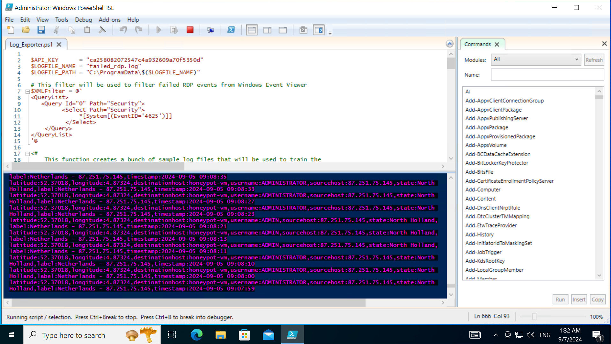
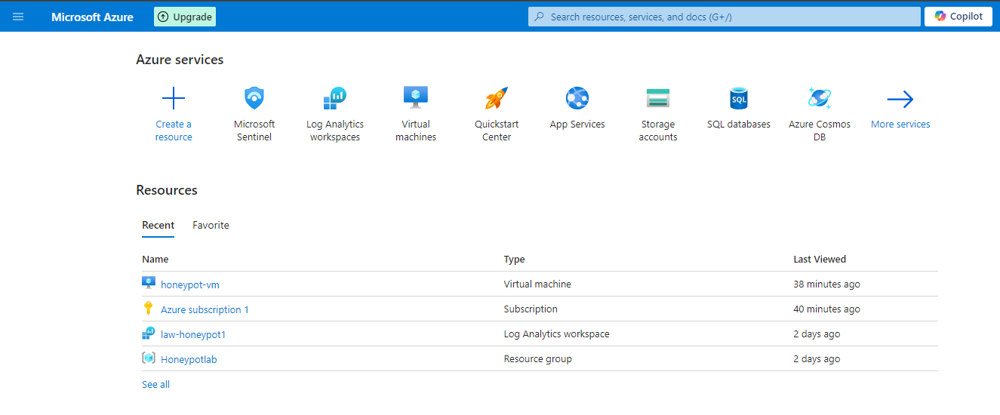
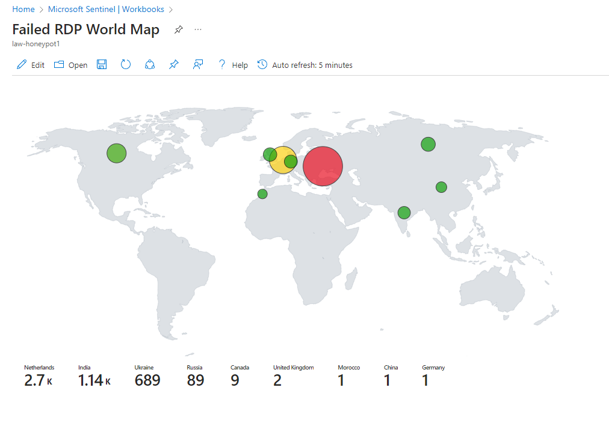

## Security Analyst - SOC Home Lab

#### Project Overview:
In this role, I focused on enhancing network security monitoring capabilities using Microsoft Azure and PowerShell scripting.

#### Key Responsibilities and Achievements:
- **Scripting and Data Extraction:**
  Utilized a custom PowerShell script to programmatically extract metadata from the Windows Event Viewer. This data was then forwarded to a third-party API to derive geolocation details such as latitude, longitude, state/province, and country.
  
  

- **Log Analytics Configuration:**
  Configured a Log Analytics Workspace in Azure to ingest custom logs enriched with geographic information. This setup was crucial for mapping and analyzing security data effectively.

  

- **Integration with Azure Sentinel:**
  Customized fields in the Log Analytics Workspace to facilitate geo data mapping in Azure Sentinel. Configured Azure Sentinel to display global attack data, focusing on RDP brute force attacks, visualized on a world map according to the physical location and magnitude of the attacks.
  
  

#### Tools and Technologies:
- **Microsoft Azure**
- **Azure Sentinel (SIEM)**
- **PowerShell**
- **Third-party APIs for geolocation**

This project allowed me to significantly enhance our monitoring capabilities and respond more effectively to potential threats with geographically contextual insights.
